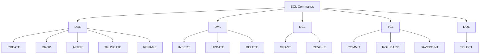

# 🗄️ SQL — Structured Query Language

A structured collection of SQL learning notes covering the fundamentals of **Structured Query Language**, relational databases, SQL command categories, and essential database operations.

> 📚 Part of my ongoing journey to strengthen my **Database Management & Backend Development** fundamentals.

---

## 📌 Overview

**SQL (Structured Query Language)** is a standardized language used to communicate with and manage data stored in relational databases.

It allows developers to interact with databases through **queries** to retrieve, insert, modify, and delete information stored in tables.

Relational databases organize information into:

* **Tables**
* **Rows**
* **Columns**
* **Relationships**

SQL provides a standardized way to work with this structured data.

---

## ⚡ Core Capabilities

SQL supports several fundamental database operations:

### 🔎 Data Retrieval

Retrieve specific records using:

* Filtering
* Sorting
* Aggregation
* Queries

### ✏️ Data Modification

Modify database records using:

* `INSERT`
* `UPDATE`
* `DELETE`

### 🏗️ Database Administration

Manage database structures by:

* Creating tables
* Modifying tables
* Removing database objects
* Establishing relationships

### 🔐 Access Control

Manage database permissions and control who can:

* View data
* Modify data
* Access specific database resources

---

## 🧩 SQL Command Categories

SQL commands can be grouped into **five major categories**:



---

## 📂 Command Classification

| Category | Full Form                    | Purpose                    | Commands                                        |
| -------- | ---------------------------- | -------------------------- | ----------------------------------------------- |
| **DDL**  | Data Definition Language     | Defines database structure | `CREATE`, `ALTER`, `DROP`, `TRUNCATE`, `RENAME` |
| **DML**  | Data Manipulation Language   | Modifies stored data       | `INSERT`, `UPDATE`, `DELETE`                    |
| **DCL**  | Data Control Language        | Controls permissions       | `GRANT`, `REVOKE`                               |
| **TCL**  | Transaction Control Language | Manages transactions       | `COMMIT`, `ROLLBACK`, `SAVEPOINT`               |
| **DQL**  | Data Query Language          | Retrieves data             | `SELECT`                                        |

---

## 🧠 Quick Reference

### DDL — Data Definition Language

Used to define and modify database structures.

```sql
CREATE
ALTER
DROP
TRUNCATE
RENAME
```

### DML — Data Manipulation Language

Used to manipulate records stored inside tables.

```sql
INSERT
UPDATE
DELETE
```

### DCL — Data Control Language

Used to manage database access and permissions.

```sql
GRANT
REVOKE
```

### TCL — Transaction Control Language

Used to control database transactions.

```sql
COMMIT
ROLLBACK
SAVEPOINT
```

### DQL — Data Query Language

Used to retrieve information from a database.

```sql
SELECT
```

---

## 📚 Learning Goals

Through this SQL section, I am building a strong foundation in:

* Relational databases
* SQL syntax
* Database structure
* Data manipulation
* Data retrieval
* Database administration
* Access control
* Transactions
* Backend database integration

---

## 🛠️ Technologies

* **SQL**
* Relational Databases
* Database Management Systems

---

## 📁 Repository Structure

```text
SQL/
│
├── SQL.md
└── README.md
```

---

## 🚀 What's Next?

The next stages of learning will expand into:

* [ ] SQL Constraints
* [ ] Primary & Foreign Keys
* [ ] SQL Operators
* [ ] Filtering with `WHERE`
* [ ] Sorting with `ORDER BY`
* [ ] Aggregate Functions
* [ ] `GROUP BY` & `HAVING`
* [ ] SQL Joins
* [ ] Subqueries
* [ ] Views
* [ ] Indexes
* [ ] Database Normalization
* [ ] Transactions
* [ ] Stored Procedures
* [ ] Real-world SQL Projects

---

## 🎯 Objective

The goal of this repository is to build a **practical and structured SQL foundation** that can be applied to backend development, data-driven applications, and real-world database systems.

---

### 👨‍💻 Learning by Building

> **Learn → Practice → Build → Improve**

This repository documents my progress as I develop stronger skills in **SQL, databases, backend development, and software engineering**.
