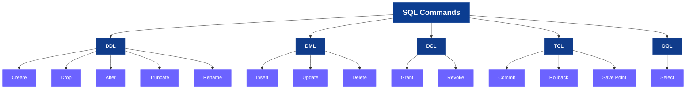

# What is SQL?

SQL stands for Structered Query Language,is the standardized programming language used to manage query,and manipultes data stored 
in relational databses.It allows users to easily communicate with database by writing commands called queries.

-> This happens because data in a relational database is stored cleanly in tables containing rows and columns.SQL acts like a
universal key to instantly retrieve or change specific pieces of information.

# Core Capabilities of SQL:-

SQL handles everything related to data infrastructure through standard operational tasks:

a.> DATA Retrieval: Fetching specific records using filters,sorting rules,and aggressions.

b.> DATA Modification: Inserting new records,updating existing data values,and deleting outdated rows.

c.> DATABASE Administration: Designing new data tables,establishing relationships betwenn tables, and modifying 
                     system structures.

d.> Access Control: Managing user permissions to restrict who can view or alter sensitive information.

# 5 Types of SQL Commands:-

